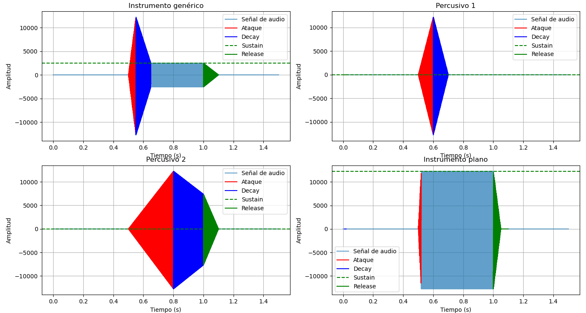
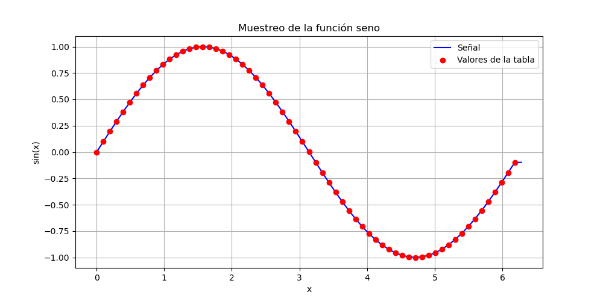
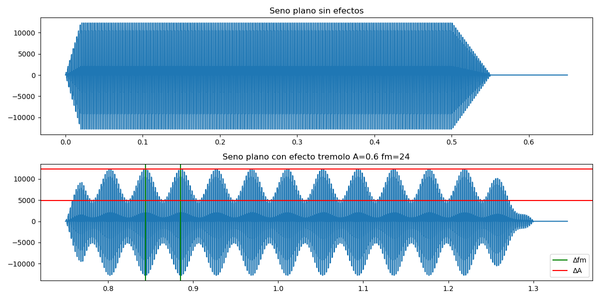
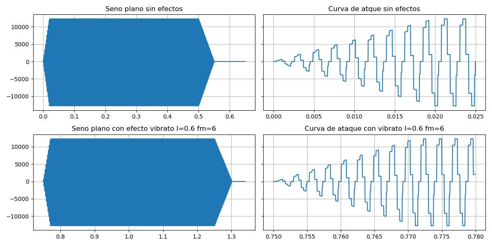
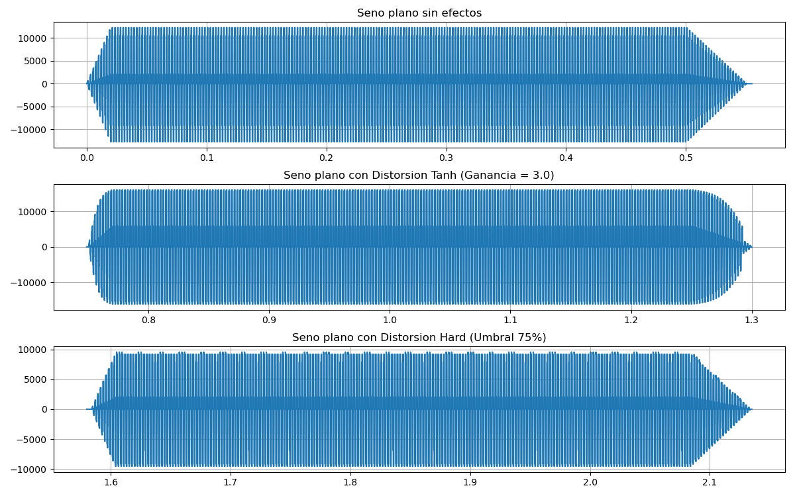
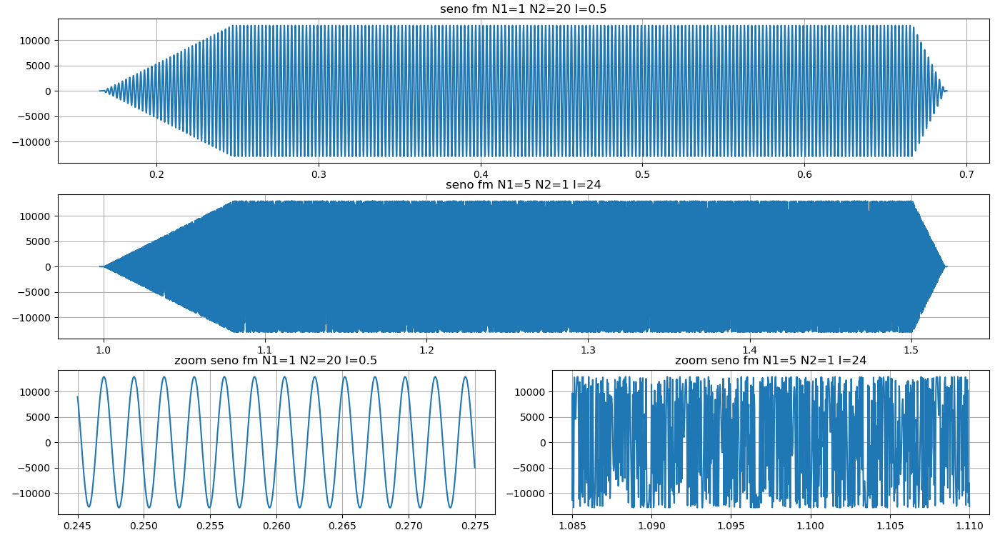
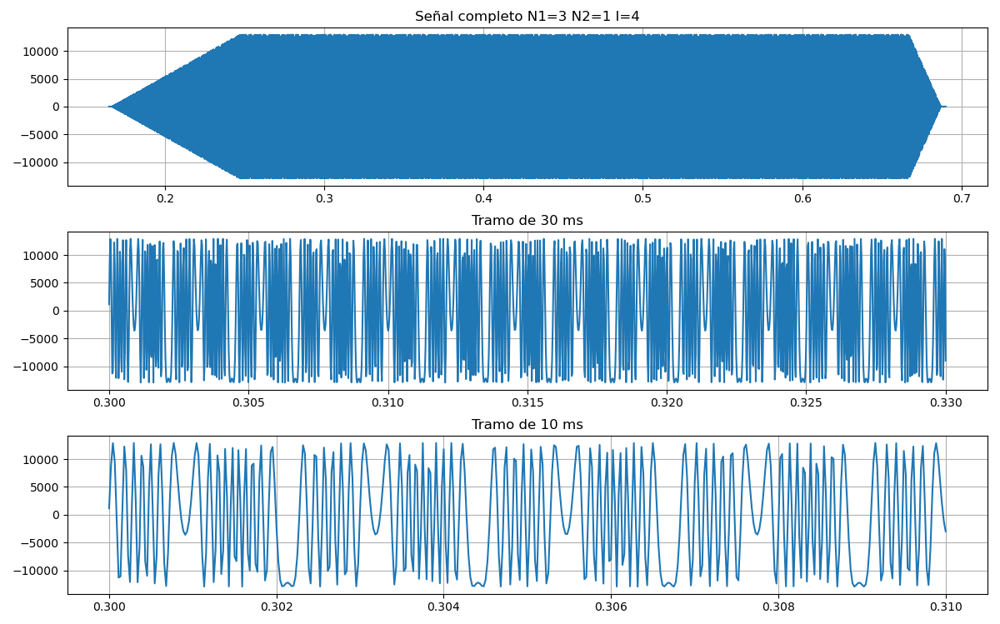

PAV - P5: síntesis musical polifónica
=====================================

Obtenga su copia del repositorio de la práctica accediendo a [Práctica 5](https://github.com/albino-pav/P5) 
y pulsando sobre el botón `Fork` situado en la esquina superior derecha. A continuación, siga las
instrucciones de la [Práctica 2](https://github.com/albino-pav/P2) para crear una rama con el apellido de
los integrantes del grupo de prácticas, dar de alta al resto de integrantes como colaboradores del proyecto
y crear la copias locales del repositorio.

Como entrega deberá realizar un *pull request* con el contenido de su copia del repositorio. Recuerde que
los ficheros entregados deberán estar en condiciones de ser ejecutados con sólo ejecutar:

~~~~~~~~~~~~~~~~~~~~~~~~~~~~~~~~~~~~~~~~~~~~~~~~~~~~~.sh
  make release
~~~~~~~~~~~~~~~~~~~~~~~~~~~~~~~~~~~~~~~~~~~~~~~~~~~~~

A modo de memoria de la práctica, complete, en este mismo documento y usando el formato *markdown*, los
ejercicios indicados.

Ejercicios.
-----------

### Envolvente ADSR.

Tomando como modelo un instrumento sencillo (puede usar el InstrumentDumb), genere cuatro instrumentos que
permitan visualizar el funcionamiento de la curva ADSR.

* Un instrumento con una envolvente ADSR genérica, para el que se aprecie con claridad cada uno de sus
  parámetros: ataque (A), caída (D), mantenimiento (S) y liberación (R).
* Un instrumento *percusivo*, como una guitarra o un piano, en el que el sonido tenga un ataque rápido, no
  haya mantenimiemto y el sonido se apague lentamente.
  - Para un instrumento de este tipo, tenemos dos situaciones posibles:
    * El intérprete mantiene la nota *pulsada* hasta su completa extinción.
    * El intérprete da por finalizada la nota antes de su completa extinción, iniciándose una disminución
	  abrupta del sonido hasta su finalización.
  - Debera representar en esta memoria **ambos** posibles finales de la nota.
* Un instrumento *plano*, como los de cuerdas frotadas (violines y semejantes) o algunos de viento. En
  ellos, el ataque es relativamente rápido hasta alcanzar el nivel de mantenimiento (sin sobrecarga), y la
  liberación también es bastante rápida.

Para los cuatro casos, deberá incluir una gráfica en la que se visualice claramente la curva ADSR. Deberá
añadir la información necesaria para su correcta interpretación, aunque esa información puede reducirse a
colocar etiquetas y títulos adecuados en la propia gráfica (se valorará positivamente esta alternativa).

**Respuesta**
Se genera una muestras de los cuatro instrumentos usando `generico.orc`, `percusivo1.orc`, `percusivo2.orc` y `plano.orc`, generando sendos ficheros `.wav`. Gráfico generado usando el script `work/ejercicio_envolvente_adsr/grafico_todos.py`.

Envolventes ADSR resultantes:



### Instrumentos Dumb y Seno.

Implemente el instrumento `Seno` tomando como modelo el `InstrumentDumb`. La señal **deberá** formarse
mediante búsqueda de los valores en una tabla.

- Incluya, a continuación, el código del fichero `seno.cpp` con los métodos de la clase Seno.

```cpp
#include <iostream>
#include <math.h>
#include "seno.h"
#include "keyvalue.h"

#include <stdlib.h>

using namespace upc;
using namespace std;

seno::seno(const std::string &param) 
  : adsr(SamplingRate, param) {
  bActive = false;
  x.resize(BSIZE);

  /*
    You can use the class keyvalue to parse "param" and configure your instrument.
    Take a Look at keyvalue.h    
  */
  KeyValue kv(param); //Los parametros definidos en dumb.orc
  int N;

  if (!kv.to_int("N",N)) // Si el fichero no incluia el parametro N, toma por defecto 40
    N = 40; //default value
  
  //Create a tbl with one period of a sinusoidal wave
  tbl.resize(N);
  float phase = 0, step = 2 * M_PI /(float) N; 
  index = 0;
  for (int i=0; i < N ; ++i) {
    tbl[i] = sin(phase);
    phase += step;
  }
}


void seno::command(long cmd, long note, long vel) {
  if (cmd == 9) {		//'Key' pressed: attack begins
    bActive = true;
    adsr.start();
    index = 0;
	  A = vel / 127.;
    float f0 = 440*pow(2,(note-69.)/12.);
    phase = 2*M_PI*f0/SamplingRate;
    phase_act = 0;
  }
  else if (cmd == 8) {	//'Key' released: sustain ends, release begins
    adsr.stop();
  }
  else if (cmd == 0) {	//Sound extinguished without waiting for release to end
    adsr.end();
  }
}


const vector<float> & seno::synthesize() {
  if (not adsr.active()) {
    x.assign(x.size(), 0);
    bActive = false;
    return x;
  }
  else if (not bActive)
    return x;

  for (unsigned int i=0; i<x.size(); ++i) {
    phase_act += phase;
    while (phase_act>2*M_PI) {
      phase_act -= 2*M_PI;
    }
    index = (int) phase_act/(2*M_PI)*tbl.size();
    x[i] = A * tbl[index];
    //if (index == tbl.size())
    //  index = 0;
  }
  adsr(x); //apply envelope to x and update internal status of ADSR

  return x;
}
```

- Explique qué método se ha seguido para asignar un valor a la señal a partir de los contenidos en la tabla,
  e incluya una gráfica en la que se vean claramente (use pelotitas en lugar de líneas) los valores de la
  tabla y los de la señal generada.

**Respuesta:** El instrumento seno funciona de la siguiente forma: Se muestrea un periodo de la señal sinusoidal y se guarda en una look-up-table tabla con N muestras. A continuación ese periodo registrado en la tabla se puede recorrer más rápido o más lento, de tal forma que se pueden generar notas más agudas, o más graves, según sea conveniente.



- Si ha implementado la síntesis por tabla almacenada en fichero externo, incluya a continuación el código
  del método `command()`.

### Efectos sonoros.

- Incluya dos gráficas en las que se vean, claramente, el efecto del trémolo y el vibrato sobre una señal
  sinusoidal. Deberá explicar detalladamente cómo se manifiestan los parámetros del efecto (frecuencia e
  índice de modulación) en la señal generada (se valorará que la explicación esté contenida en las propias
  gráficas, sin necesidad de *literatura*).

**Respuesta:** Ficheros de trabajo para este apartado ubicados en `work/ej_efectos`

Seno plano vs Seno con tremolo A=0.6 fm=24



Seno plano vs Seno con vibrato I=0.6 fm=6



- Si ha generado algún efecto por su cuenta, explique en qué consiste, cómo lo ha implementado y qué
  resultado ha producido. Incluya, en el directorio `work/ejemplos`, los ficheros necesarios para apreciar
  el efecto, e indique, a continuación, la orden necesaria para generar los ficheros de audio usando el
  programa `synth`.

**Respuesta:** Se implementan dos efectos de Distorsion que intenta simular los efectos que se aplican a las guitarras eléctricas en géneros tales como el Rock, Hard Rock, Heavy Metal y derivados. Se implementan dos variantes, una mediante tangente hiperbolica (distorsión mas suave) y otra mediante hard clipping (distorsió más agresiva). Se definen en sus respectivos ficheros ubicados en `src/effects`: `distorsion_tanh.cpp`, `distorsion_tanh.h`, `distorsion_hard.cpp` y `distorsion_hard.h`. Tambien se modifican los ficheros `src/effects/effect.cpp`y `src/meson.build` para incluir estos dos nuevos efectos.

La distorsión por tangente hiperbolica tiene por parámetro una ganancia (`G`) que puede operar notablemente entre los valores `1.0` a `5.0`.

La distorsión por hard clipping tiene por parámetro un umbral (`U`) que aplica según el valor máximo del señal actual. Por ejemplo, para `U=100` no se aplicará ningún clipping. Para `U=10` se aplicará un clipping de ±10% del máximo actual, es decir, una distorsión muy agresiva.

Orden para generar el fichero de audio: `~/PAV/P5/work/ej_efectos$ synth -e effects.orc seno.orc senoPlano_vs_tanh_vs_hard.sco senoPlano_vs_tanh_vs_hard.wav`.

A continuación se inserta un gráfico comparativo respecto una señal de referencia y ambos efectos:


 
### Síntesis FM.

Construya un instrumento de síntesis FM, según las explicaciones contenidas en el enunciado y el artículo
de [John M. Chowning](https://web.eecs.umich.edu/~fessler/course/100/misc/chowning-73-tso.pdf). El
instrumento usará como parámetros **básicos** los números `N1` y `N2`, y el índice de modulación `I`, que
deberá venir expresado en semitonos.

**Respuesta:** Ficheros de prueba y test de este apartado "Sintesis FM" ubicados en `work/sintesisFM`. Se implementa el instrumento `seno_fm` creando sus ficheros `.cpp` y `.h` y adaptando los ficheros `src/instruments/instrument.cpp` y `src/meson.build`.

Se hace una comparativa inicial con los siguientes valores:

| Parámetro | Primera muestra    | Segunda muestra        |
|-----------|--------------------|------------------------|
| `N1`      | 1                  | 5                      |
| `N2`      | 20                 | 1                      |
| `I`       | 0.5 semitonos      | 24 semitonos           |
| Forma     | Suave, ondulada    | Ruidosa, asimétrica    |
| Timbre    | Simple, limpio     | Metálico, brillante    |
| Visual    | Casi seno          | Caótica, irregular     |

Fichero de audio resultante `fm.wav` resultado de aplicar los ficheros `fm.sco` y `senoFM.orc`. Gráficamente:



- Use el instrumento para generar un vibrato de *parámetros razonables* e incluya una gráfica en la que se   vea, claramente, la correspondencia entre los valores `N1`, `N2` e `I` con la señal obtenida.

**Respuesta:** Se genera el siguiente gráfico a partir del fichero de audio `significativo.wav`, a partir del fichero `senoFM.orc` y `significativo.sco`. Los párametros usados son: `N1=3; N2=1;  I=4;`.

Con estos parámetros conseguimos que la portadora sea 3 veces la frecuencia de la nota, que la moduladora sea la misma y un desvío de 4 semitonos. El resultado es una señal con vibrato cíclico claramente visible, cada ciclo de modulación deformando tres ciclos portadora. El resultado es una deformación periódica clara, donde cada periodo de la moduladora afecta un grupo reconocible de ondas portadoras. Visualmente, se ve una ondulación o ensanchamiento periódico del seno.



- Use el instrumento para generar un sonido tipo clarinete y otro tipo campana. Tome los parámetros del
  sonido (N1, N2 e I) y de la envolvente ADSR del citado artículo. Con estos sonidos, genere sendas escalas
  diatónicas (fichero `doremi.sco`) y ponga el resultado en los ficheros `work/doremi/clarinete.wav` y
  `work/doremi/campana.work`.

**Respuesta:** Se generan los instrumentos clarinete y campana con los siguiente parámetros:

```
# campana
1   seno_fm ADSR_A=0.01;    ADSR_D=0.0;   ADSR_S=0.0; ADSR_R=2.0;    N1=1; N2=1.414;  I=14;
# clarinete
1   seno_fm ADSR_A=0.01;    ADSR_D=0.1;   ADSR_S=0.7; ADSR_R=0.3;    N1=3; N2=1;  I=2;
```

Se generan los ficheros `.wav` en el directorio `work/doremi`.

  * También puede colgar en el directorio work/doremi otras escalas usando sonidos *interesantes*. Por
    ejemplo, violines, pianos, percusiones, espadas láser de la
	[Guerra de las Galaxias](https://www.starwars.com/), etc.

**Respuesta:** Se intenta implementar (sin mucho éxito) generar la escala diatónica con un efecto de maullido y con un efecto de pulso de energía futurista. Se usan los siguientes parámetros. Los ficheros `miau.wav` y `pulsoFuturista.wav` están en la misma carpeta que clarinete y campana.

```
# maullido
1   seno_fm ADSR_A=0.01;    ADSR_D=0.2;   ADSR_S=0.4; ADSR_R=0.5;    N1=2.0; N2=1.0;  I=7;
# pulso de energia futurista
1   seno_fm ADSR_A=0.005;    ADSR_D=0.05;   ADSR_S=0.0; ADSR_R=1;    N1=4.0; N2=1.0;  I=20;
```

### Orquestación usando el programa synth.

Use el programa `synth` para generar canciones a partir de su partitura MIDI. Como mínimo, deberá incluir la
*orquestación* de la canción *You've got a friend in me* (fichero `ToyStory_A_Friend_in_me.sco`) del genial
[Randy Newman](https://open.spotify.com/artist/3HQyFCFFfJO3KKBlUfZsyW/about).

- En este triste arreglo, la pista 1 corresponde al instrumento solista (puede ser un piano, flautas,
  violines, etc.), y la 2 al bajo (bajo eléctrico, contrabajo, tuba, etc.).
- Coloque el resultado, junto con los ficheros necesarios para generarlo, en el directorio `work/music`.
- Indique, a continuación, la orden necesaria para generar la señal (suponiendo que todos los archivos
  necesarios están en directorio indicado).

**Respuesta:** Se genera el siguiente fichero de orquestra para orquestar la canción; `ToyStory.orc`:
```
# piano
1	seno	ADSR_A=0.01; ADSR_D=0.3; ADSR_S=0.0; ADSR_R=0.4; N=40;

# bajo eléctrico
2	seno	ADSR_A=0.05; ADSR_D=0.2; ADSR_S=0.8; ADSR_R=0.3; N=40;
```

Se genera el fichero de audio de la canción mediante la siguiente instrucción: `~/PAV/P5/work/music$ synth ToyStory.orc ToyStory_A_Friend_in_me.sco ToyStory.wav -g 0.1`

También puede orquestar otros temas más complejos, como la banda sonora de *Hawaii5-0* o el villacinco de
John Lennon *Happy Xmas (War Is Over)* (fichero `The_Christmas_Song_Lennon.sco`), o cualquier otra canción
de su agrado o composición. Se valorará la riqueza instrumental, su modelado y el resultado final.
- Coloque los ficheros generados, junto a sus ficheros `score`, `instruments` y `effects`, en el directorio
  `work/music`.

- Indique, a continuación, la orden necesaria para generar cada una de las señales usando los distintos
  ficheros.


**Respuesta:** Se orquesta el famoso tema _Paranoid_ de _Black Sabbath_.

Para generar el fichero de audio: `~/PAV/P5/work/music$ synth -b 153 Paranoid.orc Black_Sabbath_-_Paranoid.sco Paranoid.wav -g 0.1`

Se orquesta el tema _Kraid's Lair_ del primer videojuego de la saga _Metroid_, cuya salida tuvo fecha en 1986 para la primera "Nintendo", la NES.

Para generar el fichero de audio: `~/PAV/P5/work/music$ synth -b 65 Kraid.orc Kraid.sco Kraid.wav -g 0.1`

> NOTA:
>
> No olvide escuchar el resultado generado y comprobar que no se producen ruidos extraños o distorsiones.
> Sobre todo, tenga en cuenta la salud auditiva de quien será encargado de corregir su trabajo.
